```{r setup, include=FALSE}
options(htmltools.dir.version = FALSE)
```


.pull-left[
  
  <br>
  <br>
  * Long-Term Ecological Research: NSF program established 1980
  
  * Currently 28 LTER sites
  
  * Central Arizona-Phoenix site established 1997
  
]

.pull-right[
  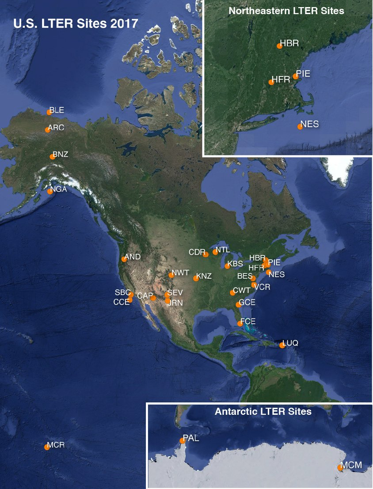
]


---

.cap-red[**CAP LTER study area**]

.center[
  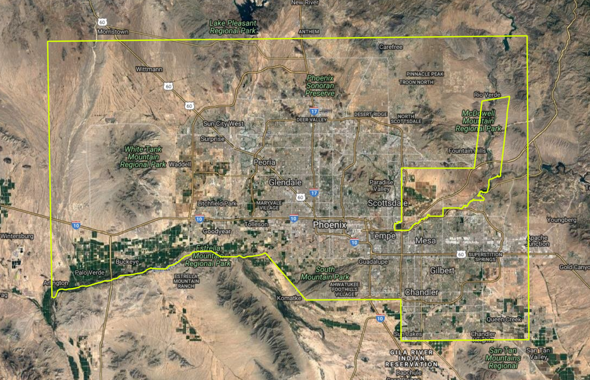
  <!-- 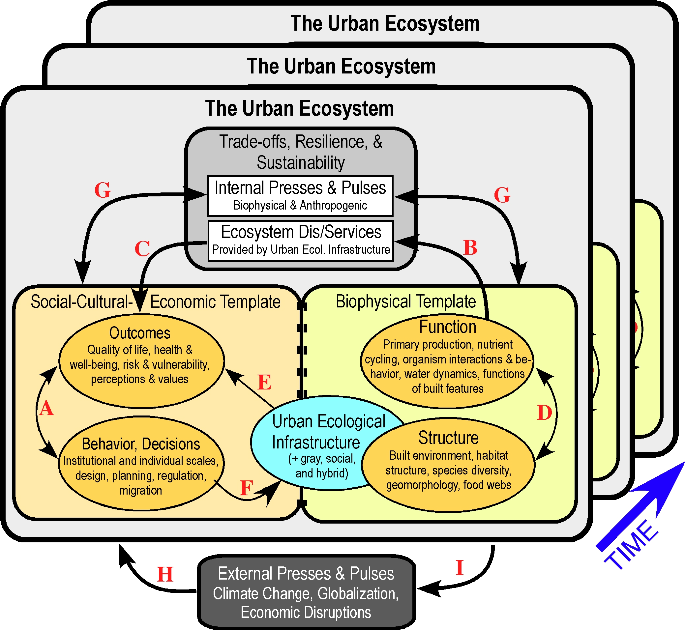 -->
]


---

__*central question:*__ .cap-red[How do the services provided by dynamic urban ecosystems and their infrastructure affect human outcomes and behavior, and how do human actions affect patterns of urban ecosystem structure and function and, ultimately, urban sustainability and resilience?]

<br>
  
.center[
  
]


---

.cap-red[**CAP LTER organizational structure: Integrated Research Teams (IRTs)**]

.center[
  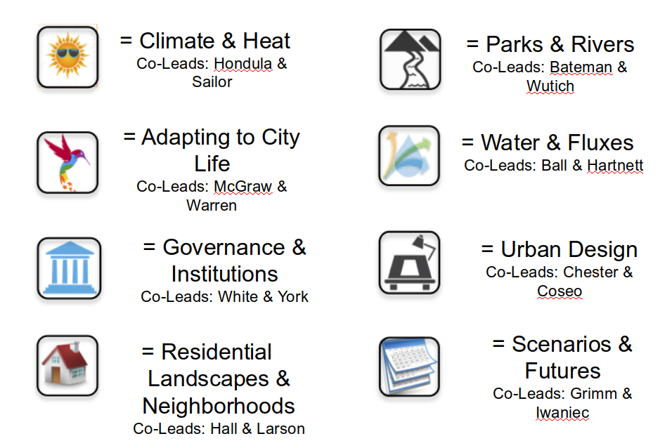
]


---

.cap-red[**CAP LTER long-term monitoring or experiments with a biodiversity focus or component**]

.center[
  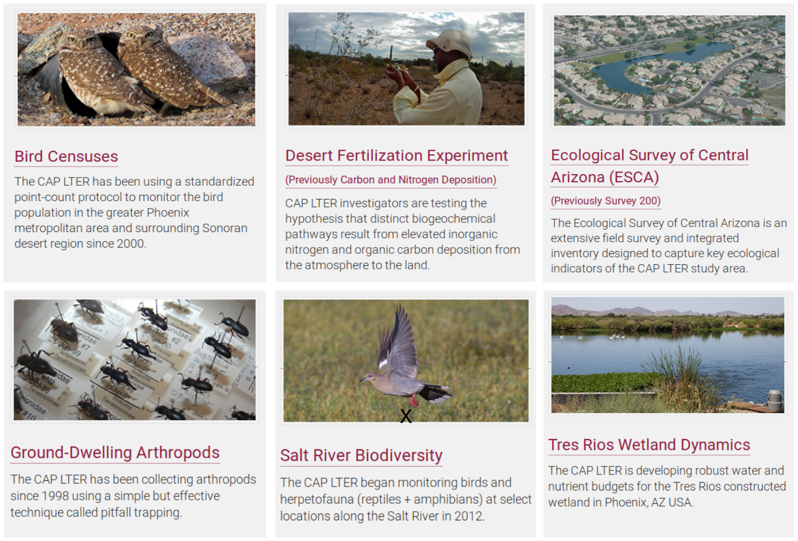
]


---

.cap-red[**CAP LTER long-term monitoring of arthropods: quarterly sampling at ~40 locations**]

.center[
  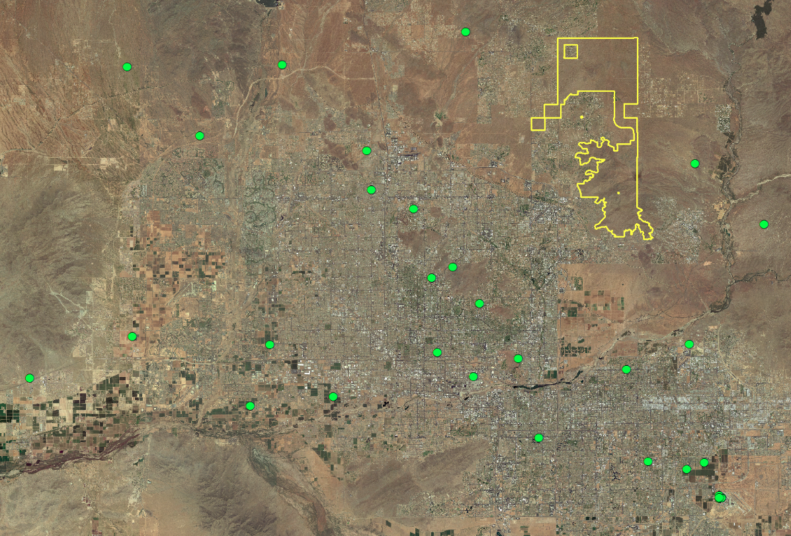
]


---

.cap-red[**CAP LTER long-term monitoring of arthropods: quarterly sampling at ~40 locations**]

.center[
  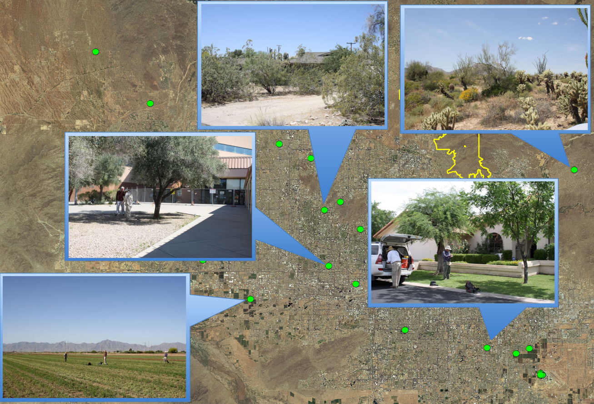
]


---

camera trapping placeholder?


---

.cap-red[**K-12 education & outreach**]

.small[
* provide training and materials to teachers, ASU students, non-formal educators
* partner with other organizations to update, revise, develop lesson plans & learning activities
* topics: ecologies of the Sonoran desert and Phoenix area urban ecosystem, and CAP LTER research such as social science and microclimates
* develop scientific skills in areas such as modeling, data analysis, & research design
]

.center[
  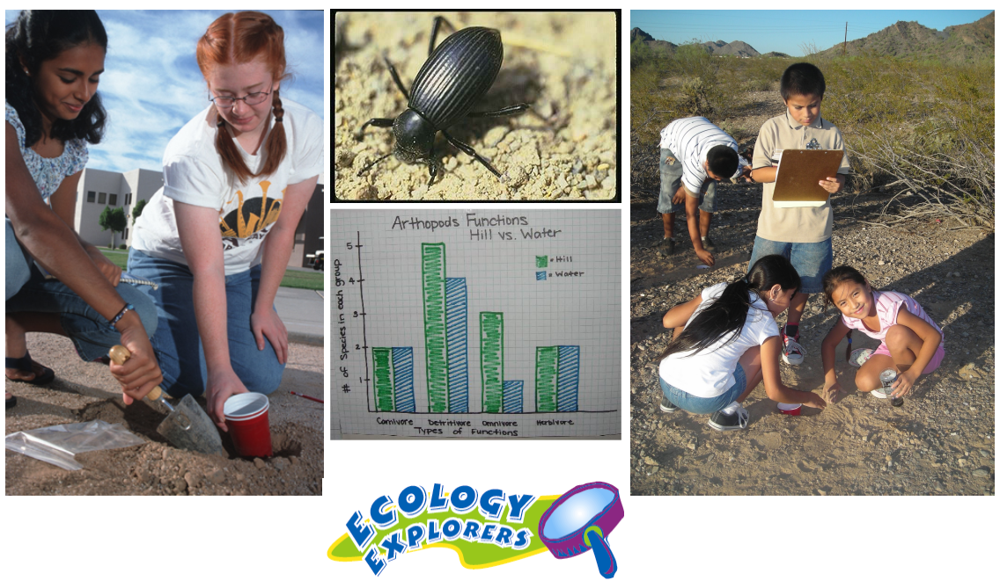
  <!--  -->
]


---

.pull-left[
  .cap-red[**~~citizen~~ resident science**]
  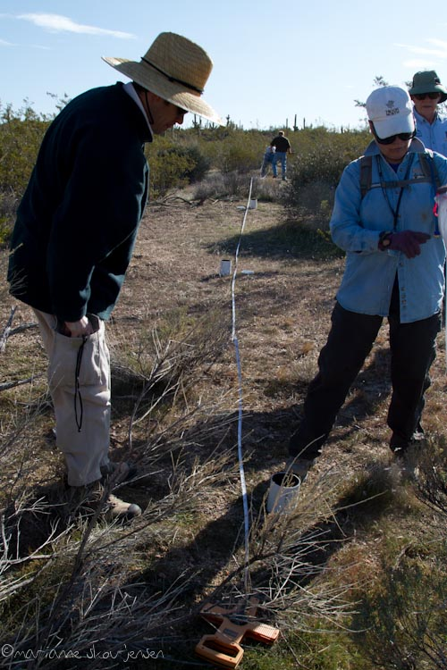
  <br>
  .med-grey[photos: Marianne Jensen]
]
.pull-right[
  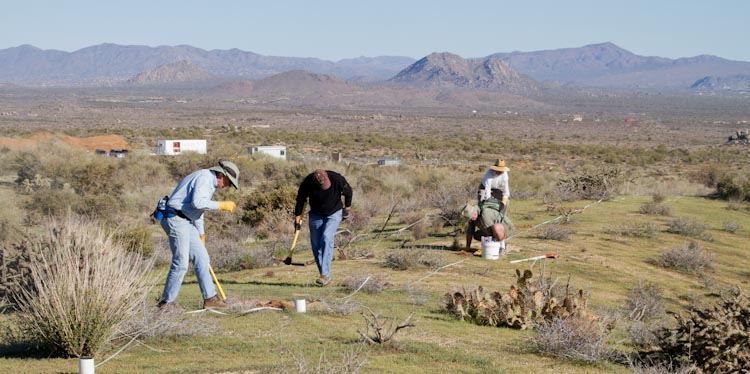
  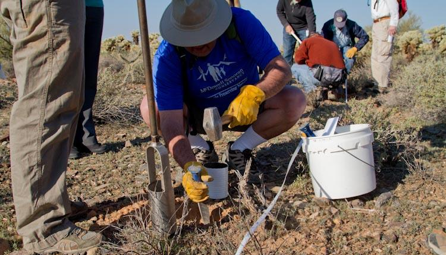
  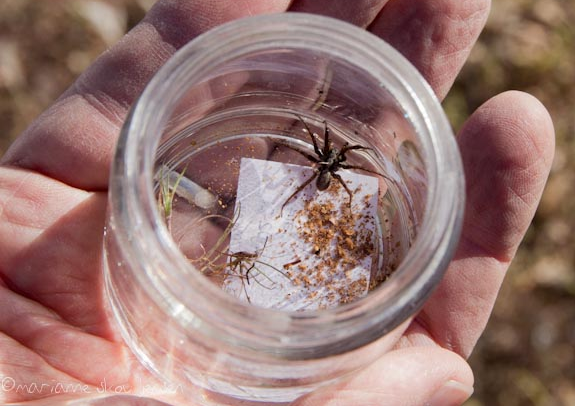
]


---

<br>
<br>

.center[
  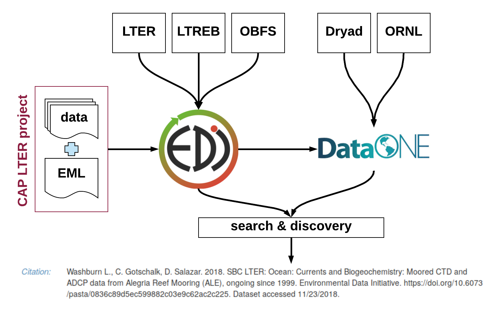
]


---

.cap-red[**research data workflow, a model**]

<br>

.center[
  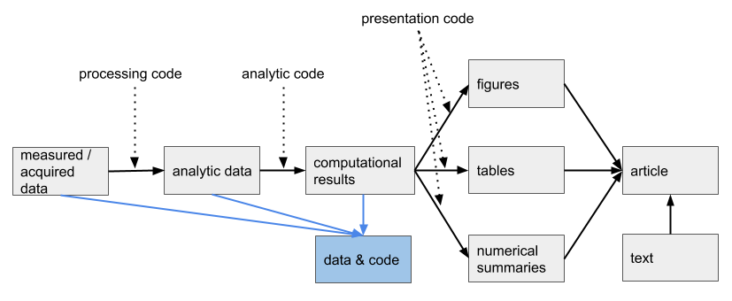
]

--

.center[
  **version control – scripting – databases – naming – organization**
]