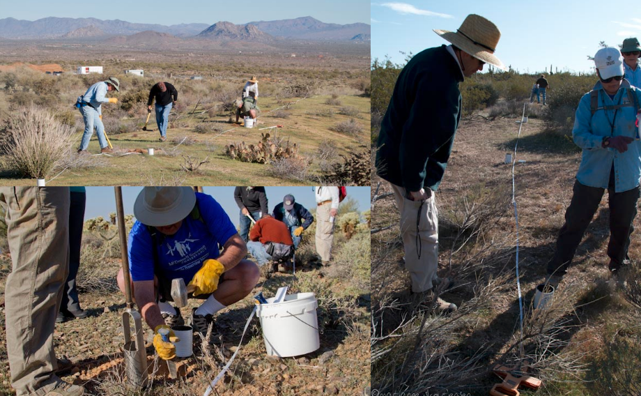

```{r setup, include=FALSE}
options(htmltools.dir.version = FALSE)
```


.pull-left[

  
  
  * Long-Term Ecological Research: NSF program established 1980
  
  * Currently 28 LTER sites
  
  * Central Arizona-Phoenix site established 1997
  
]

.pull-right[
  
]


---

__*central question:*__ How do the services provided by dynamic urban ecosystems and their infrastructure affect human outcomes and behavior, and how do human actions affect patterns of urban ecosystem structure and function and, ultimately, urban sustainability and resilience?
  
.center[
  
]


---

<br>
<br>

.center[
  
  <!--  -->
]


---

.center[
  
]